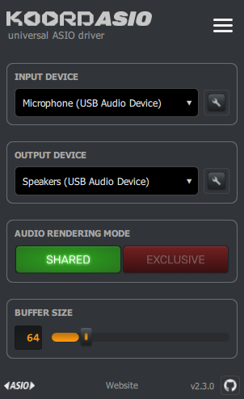

# KoordASIO, a user-friendly universal ASIO driver

### [⬇ Download KoordASIO for Windows][download]

Run the installer and KoordASIO appears in the ASIO device list of any host
application. No account, no configuration files, nothing else to install.

There is a [project page][site] with a short overview, and older versions and
release notes are on the [releases page][releases].

> **Note:** KoordASIO is no longer distributed through the Microsoft Store.
> The installer above is the only supported download.

## Description

KoordASIO is a universal [ASIO][] driver, meaning that it is not tied to
specific audio hardware. You can use it with any audio hardware that doesn't come
with its own drivers, or where you need features that aren't available with your
bundled ASIO drivers. KoordASIO is a derivative of [FlexASIO][] that focuses on
WASAPI and user convenience.

KoordASIO adds an intuitive Control GUI that gives users an easy way to configure
low-latency WASAPI operation without editing config files. KoordASIO focuses on
simplicity, with a choice of WASAPI Shared Mode (mix ASIO audio with other
application audio) and WASAPI Exclusive Mode (lowest-latency, bit-perfect
operation).

## Requirements

 - Windows Vista or later
 - Compatible 64-bit ASIO Host Applications

## Usage

After running the [installer][releases], KoordASIO should appear in the ASIO
driver list of any ASIO Host Application (e.g. Ableton, Cubase, Reaper). The Control
GUI (KoordASIOControl.exe) can be launched at any time by clicking on the "ASIO Setup"
button in your host software, or as usual via the Windows launcher.

The installer sets up a working low-latency configuration straight away:

 - WASAPI [Exclusive Mode][BACKENDS]
 - Uses the Windows default recording and playback audio devices
 - 32-bit float sample type
 - 32-sample buffer size
 - Minimum "suggested" latency

If Exclusive Mode stops other applications from playing audio through the same
device — which is what "exclusive" means — switch to [Shared Mode][BACKENDS] in
the Control GUI.

The KoordASIO Control GUI lets you select your Input/Output audio devices (with
a link to the relevant Windows control panel), choose between Shared or
Exclusive mode, and change the Buffer Size in steps between 32 and 2048 samples.
The menu button in the top right holds the less-used options: disabling input
when it isn't needed, presenting mono devices as stereo for ASIO hosts that
expect two channels, and turning the system tray icon on or off.

KoordASIO keeps its settings in `.KoordASIO.toml` in your user folder, and
writes the file as soon as you change anything — there is no Save button.

## Troubleshooting
Hopefully KoordASIO should work seamlessly out-of-the-box for you. If you do notice
problems, please create an issue on [the Issues page][issues].

---

*ASIO is a trademark and software of Steinberg Media Technologies GmbH*

[ASIO]: http://www.steinberg.net/en/company/technologies/asio.html
[FlexASIO]: https://github.com/dechamps/FlexASIO
[download]: https://github.com/kormix-io/KoordASIO/releases/latest/download/KoordASIO-Setup.exe
[releases]: https://github.com/kormix-io/KoordASIO/releases
[site]: https://kormix-io.github.io/KoordASIO/
[issues]: https://github.com/kormix-io/KoordASIO/issues
[BACKENDS]: BACKENDS.md
